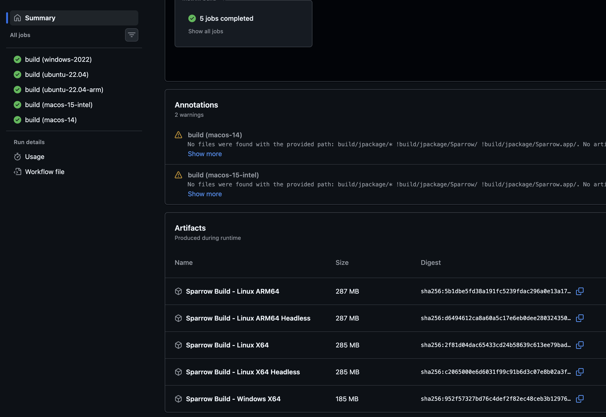
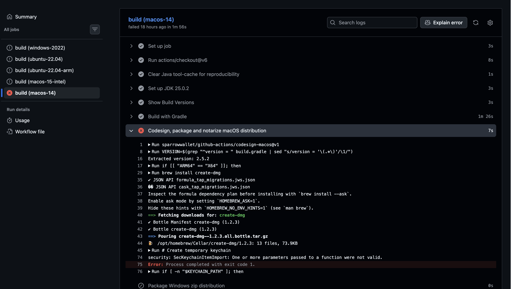

# Build Report

We have successfully ran the CI pipeline to build packages for Linux and Windows platforms. 

For macOS, we are able to build the application successfully on local machines. However, building for macOS within the CI pipeline requires Apple Store Connect credentials for code signing.

## Open Question

- Can Alpen provide Apple Store Connect credentials for macOS CI builds during development for testing porpoises?